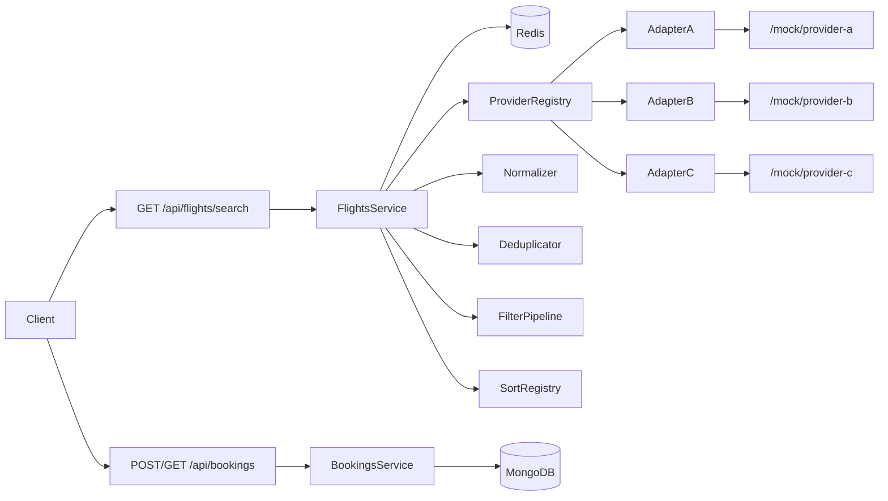
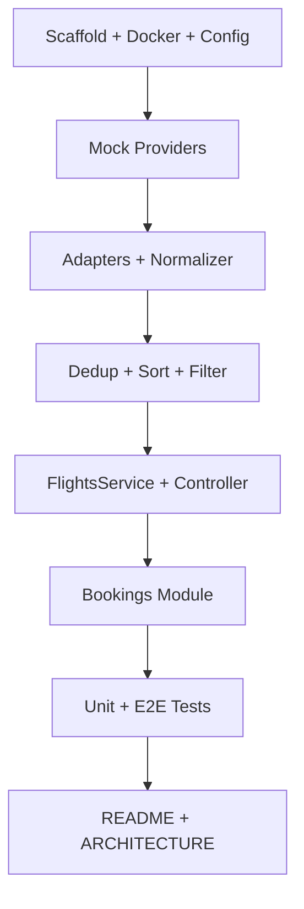

# Flight Search Aggregator — Implementation Plan

## Goal

Implement the iBox Lab take-home backend: aggregate flights from 3 mock providers, deduplicate by physical flight, support sort/filter, expose stable `flightId`, communicate result completeness, and persist bookings. Use the **Open/Closed** layout from `iboxlab_cursor_prompt.md` so every future extension is a new file + config entry, not a rewrite.

**Stack:** NestJS + MongoDB + Redis

## Architecture (high level)



**Layering rule:** controllers validate + route; services orchestrate; adapters/normalizer/deduplicator/strategies are pure or thin; config drives provider list, timeouts, TTLs, prefixes.

## Directory structure (create from day 1)

```
src/
├── config/                    # Typed AppConfig + FLIGHT_PROVIDERS JSON
├── core/                      # Envelope interceptor, exception filter, pagination
├── mock-providers/            # 3 mock endpoints (same process)
├── flights/
│   ├── providers/             # IFlightProvider + BaseProviderAdapter + A/B/C
│   ├── registry/              # ProviderRegistry (config ↔ adapters)
│   ├── normalizer/            # Schema mapping (pure)
│   ├── deduplicator/          # Merge duplicates (pure)
│   ├── strategies/sort/       # Registry + price/duration/departure
│   ├── strategies/filter/     # Pipeline + carrier/maxPrice/maxStops
│   └── dto/                   # SearchQuery, UnifiedFlight, SearchResponse
└── bookings/
    ├── enums/                 # BookingStatus
    ├── value-objects/         # BookingReference
    ├── schemas/               # Mongoose Booking
    └── dto/                   # CreateBooking, Passenger, FlightSnapshot
```

This matches the cursor prompt exactly — the structure *is* the expansion contract.

---

## Phase 1 — Scaffold and infrastructure (~45 min)

1. `nest new` in `D:\node projects\iboxlab`
2. Install deps: `@nestjs/mongoose`, `@nestjs/config`, `@nestjs/cache-manager`, `cache-manager@5`, `@keyv/redis`, `@nestjs/axios`, `class-validator`, `@nestjs/swagger`, `uuid`, dev: `mongodb-memory-server`, `supertest`
3. Add `.env` with `FLIGHT_PROVIDERS` JSON array, Mongo URI `?replicaSet=rs0`, Redis URL, cache TTL, booking prefix `BK`
4. Add `docker-compose.yml`: Mongo 7 with replica set init + Redis 7 healthchecks
5. Wire `app.module.ts` + `main.ts`: global prefix `api`, validation pipe, Swagger at `/docs`, response envelope, global exception filter

**Expansion hook:** all env keys typed in `AppConfig` — new config = one interface field + default, no scattered `process.env` reads.

---

## Phase 2 — Mock providers (~30 min)

Implement `mock-providers.controller.ts` with exact assignment payloads for A/B/C plus configurable random latency (100–600ms).

Routes:

- `GET /mock/provider-a`
- `GET /mock/provider-b`
- `GET /mock/provider-c`

**Edge case:** latency proves `Promise.allSettled` parallelism in logs/tests.

---

## Phase 3 — Provider adapters and normalization (~90 min)

### Contract

`IFlightProvider`: `providerName` + `fetchFlights(query)`.

`BaseProviderAdapter` template method:

- Load per-provider config (`url`, `enabled`, `timeoutMs`)
- Skip disabled providers (return `[]`, no HTTP)
- HTTP GET with **per-provider timeout** via RxJS `timeout()`
- On timeout/error: log + return `[]` (never throw to caller)
- `extractFlights()` + `normalize()` per subclass
- Optional `matchesQuery()` for client-side route filtering

### Normalizer (`flight.normalizer.ts`)

| Provider | Critical mapping | Edge case |
|----------|------------------|-----------|
| A | `fare_usd` → price, ISO dates | Direct `Date` parse |
| B | `departure_time` `"2026-07-01 09:15"` | Replace space with `T`, append `:00Z` (document UTC assumption) |
| C | `times.dep` Unix **seconds** | Multiply by 1000 |
| All | `stops` / `segments` / `layovers` | Unified `stops` field |

**Stable `flightId`:** `{flightNo}-{departAt_ISO}` — same physical flight across providers gets same ID.

**Precompute `durationMinutes`** at normalization (overnight AA205: 22:10 → 02:40 = 270 min).

### Provider registry

`ProviderRegistry` on `OnModuleInit`:

- Match adapter `providerName` to `FLIGHT_PROVIDERS[].name`
- Log enabled/disabled; error if zero active providers

**Expansion:** add Provider D = `provider-d.adapter.ts` + one JSON config entry + register in `flights.module.ts` provider array.

---

## Phase 4 — Deduplication, filter, sort (~60 min)

### Deduplicator (`flight.deduplicator.ts`)

Group by `flightId`:

- Merge `availableFromProviders` (sorted, unique)
- Keep **cheapest** `price`; set `cheapestProvider`

**Assignment proof cases:**

| Flight | Providers | Expected after dedup |
|--------|-----------|----------------------|
| EK585 | A:$410, B:$399, C:$405 | 1 row, price **399**, 3 providers listed |
| BS220 | A:$310, B:$295 | 1 row, price **295** |
| AA101 | A:$320, C:$335 | 1 row, price **320** |
| BS118, CJ300, AA205 | single provider each | preserved as-is |

### Sort strategies (registry pattern)

Default `sortBy=price`, `sortOrder=asc`. Also: `duration`, `departure`. Unknown key → `400` with available keys listed.

### Filter pipeline

Only run when query param present:

- `carrier` (uppercase match)
- `maxPrice`
- `maxStops`

`passengers` is validated and echoed in `meta.query` but does **not** change per-seat price in v1 (document in README as future pricing hook).

---

## Phase 5 — Search orchestration (~60 min)

`FlightsService.search()` pipeline:

1. **Cache lookup** (Redis via `cache-manager` + Keyv) — key `v1:flights:{from}:{to}:{date}:{passengers}:{sortBy}:{sortOrder}:{carrier}:{maxPrice}:{maxStops}`
2. **Parallel fetch** with `Promise.allSettled` (never `Promise.all`)
3. Build `providerStatuses[]`: `{ provider, status: ok|error|disabled, flightsReturned, errorMessage? }`
4. Deduplicate → filter → sort
5. Cache result (TTL from config)
6. Return `SearchResponseDto`: `{ meta, flights }`

**Completeness signals in `meta`:**

- `providers[]` per-provider status
- `total` result count
- `fetchDurationMs`
- `isFromCache`
- `appliedSort` / `appliedFilters`
- `generatedAt`

Controller sets headers: `X-Cache: HIT|MISS`, `X-Fetch-Duration-Ms`.

### Search edge cases checklist

| Scenario | Expected behavior |
|----------|-------------------|
| One provider times out | Partial results + provider `error` in meta |
| All providers fail | `200`, `flights: []`, all providers `error` |
| Provider disabled in config | `disabled`, 0 flights, no HTTP call |
| Invalid IATA / date / sort | `400` validation or sort registry error |
| Cache hit | Skip provider calls; `isFromCache: true` |
| Same search, different sort | Different cache key → fresh fetch |
| No matching flights after filter | `200`, `total: 0` |

---

## Phase 6 — Bookings (~75 min)

### Endpoints (assignment)

- `POST /api/bookings` — create
- `GET /api/bookings/{reference}` — retrieve

Also include `GET /api/bookings` (paginated) from prompt — useful for demo/debug; zero extra architecture cost.

### Model

`Booking` schema:

- `reference` (unique, `BK-{16chars}`)
- `flightId` + immutable `flightSnapshot` (client sends snapshot from search — frozen at booking time)
- `passengers[]`, `totalPrice = price.amount × passenger count`
- `status` via `BookingStatus` enum
- `idempotencyKey` (sparse index)
- Indexes: `{flightId, status}`, `{passengers.passport, flightId}`, `{createdAt}`

### Service rules

1. **Idempotency:** same `idempotencyKey` → return existing booking (safe retries)
2. **Duplicate guard:** same lead passenger passport + same `flightId` + `CONFIRMED` → `409`
3. **Mongo transaction** (requires replica set): create inside `session.withTransaction`
4. **`session.endSession()` in `finally`** always
5. `BookingReference.generate(prefix)` — never raw `uuidv4()` in service

### Booking edge cases

| Scenario | Response |
|----------|----------|
| Valid create | `201`, reference `BK-...` |
| Unknown reference | `404` |
| Duplicate passenger+flight | `409` |
| Retry with same idempotency key | `200/201`, same reference |
| Invalid body (passport format, empty passengers) | `400` |
| `flightId` mismatch vs snapshot | Accept but document; optional v2 validation |
| Concurrent duplicate bookings | Transaction + `VersionError` → `409` |

---

## Phase 7 — Testing (~90 min)

### Unit (pure logic, fast)

| File | Cases |
|------|-------|
| `flight.normalizer.spec.ts` | All 3 schemas; B date parse; C epoch ×1000; `buildFlightId` determinism; overnight duration |
| `flight.deduplicator.spec.ts` | EK585 merge; BS220 cheapest; provider list merge |
| `sort-strategy.registry.spec.ts` | Unknown key throws; each strategy order |
| `filter-pipeline.spec.ts` | Applicability gating; combined filters |

### E2E (`test/flights.e2e-spec.ts`)

Boot app with `mongodb-memory-server`; mock providers in-process; use in-memory or test Redis.

Critical assertions:

- Search DAC→DXB 2026-07-01: EK585 appears **once**, price **399**
- `maxStops=0` excludes BS220
- `carrier=EK` filters correctly
- `sortBy=price&sortOrder=desc` ordering
- Second search → `X-Cache: HIT`
- POST booking → GET by reference
- Fake reference → 404
- Duplicate booking → 409
- Idempotency key → same reference

---

## Phase 8 — Docs and submission (~45 min)

### `README.md`

- 3-command quick start (`docker compose up`, `npm i`, `npm run start:dev`)
- curl examples for every endpoint
- Env var table
- "Add provider / sort / filter" in 3 steps each
- Note: Mongo must use replica set for transactions

### `ARCHITECTURE.md`

- Request flow diagram
- Why registry + strategy pattern (not switch/if chains)
- `Promise.allSettled` vs `Promise.all`
- Deduplication walkthrough (EK585 example)
- Booking concurrency + idempotency
- **What I'd do next** section (circuit breaker, rate limiting, seat inventory, currency filter, OpenTelemetry, `/health`, API versioning)

---

## Expansion map (built-in, not built yet)

| Future feature | How to add (no core rewrites) |
|----------------|-------------------------------|
| Provider D | New adapter file + `.env` JSON entry |
| Sort by stops | New `stops.sort-strategy.ts` + register in module |
| Currency conversion | New filter strategy |
| Seat limits | New collection + `$inc` in booking transaction |
| Circuit breaker | Wrap `BaseProviderAdapter.fetchFlights` HTTP call |
| Auth / payments | New `auth/` module; guard controllers |
| Event-driven side effects | Emit `booking.created` from service TODO hook |
| API v2 | New DTOs; bump cache key prefix `v2` |

---

## Implementation order (single session)



## Absolute rules (enforce in review)

1. Per-provider `timeoutMs` from config — never one global timeout
2. `Promise.allSettled` for provider fetch — never `Promise.all`
3. `BookingStatus.CONFIRMED` enum — no magic `'confirmed'` strings in services
4. `lean()` on read-only Mongoose queries
5. `FlightsService` has zero provider-specific code and zero sort/filter switch statements
6. Adapter `providerName` must exactly match `FLIGHT_PROVIDERS[].name`

## Time budget (~6–8 hours)

| Phase | Time |
|-------|------|
| Scaffold + infra | 45m |
| Mocks | 30m |
| Adapters + normalizer | 90m |
| Dedup/sort/filter | 60m |
| Search service | 60m |
| Bookings | 75m |
| Tests | 90m |
| Docs + polish | 45m |

If time runs short, cut E2E breadth first — never cut normalizer/deduplicator unit tests or provider partial-failure handling.

---

## Task checklist

- [ ] Initialize NestJS project, deps, docker-compose (Mongo replica set + Redis), typed config, global pipes/filters/Swagger
- [ ] Implement mock provider controller with assignment payloads and simulated latency
- [ ] Build provider adapters (A/B/C), normalizer, deduplicator, sort/filter registries, ProviderRegistry
- [ ] Implement FlightsService (cache, allSettled, meta completeness) + GET /api/flights/search controller
- [ ] Implement Booking schema, reference VO, transactional service, POST/GET booking endpoints
- [ ] Unit tests for normalizer/deduplicator/sort/filter + E2E for search dedup, cache, booking flows
- [ ] Write README.md (quick start, curls, env table) and ARCHITECTURE.md (flows, trade-offs, next steps)
