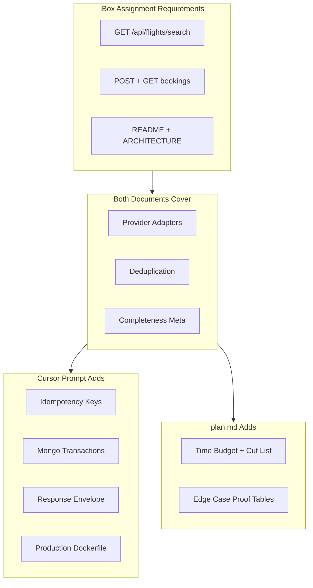

# plan2 — Comparison, Recommendation, and Final Plan

> **Verdict:** Use **both** documents. `iboxlab_cursor_prompt.md` is your technical blueprint; `plan.md` is your execution guide. This file merges them with explicit priorities.

---

## Side-by-side comparison

| Dimension | [plan.md](./plan.md) | [iboxlab_cursor_prompt.md](h:\downloads\iboxlab_cursor_prompt.md) |
|-----------|----------------------|---------------------------------------------------------------------|
| **Size / format** | ~350 lines, roadmap | ~2,200 lines, full implementation spec with code |
| **Purpose** | What to build, in what order, with time budget | How to build it — file-by-file with copy-paste code and rationale |
| **Architecture** | Same: NestJS + MongoDB + Redis, OCP, adapters, registries | Same — plan.md was derived from this prompt |
| **Edge cases** | Tables (dedup proof cases, search/booking scenarios) | Embedded in code comments + test phase list |
| **Extensibility** | Expansion map (future features) | Extensibility proof table + "why" essays per pattern |
| **Time awareness** | Explicit 6–8h budget; "cut E2E first if short" | No prioritization — builds everything |
| **Interview prep** | Light — focuses on deliverables | Heavy — every decision explained for technical defense |
| **Extras beyond assignment** | Notes optional items (paginated bookings list) | Idempotency, transactions, response envelope, pagination decorator, Dockerfile |
| **Risk** | Less detail during coding = more decisions | Risk of over-building or running out of time if followed literally end-to-end |

### What they agree on (core — do all of this)

- Provider adapter pattern with `BaseProviderAdapter` + per-provider timeout
- `Promise.allSettled` for parallel provider fetch
- Normalizer for 3 different schemas (B date format, C Unix seconds)
- Deduplication by `flightId` = `{flightNo}-{departAt_ISO}`, keep cheapest price
- Sort/filter via registries (no switch statements in `FlightsService`)
- Search `meta` with provider completeness status
- Redis cache with versioned cache keys
- MongoDB bookings with flight snapshot, reference VO, enum status
- Unit tests on normalizer + deduplicator; E2E on search + booking
- `README.md` + `ARCHITECTURE.md`

### Where they differ

| Topic | plan.md | cursor prompt |
|-------|---------|---------------|
| **Code during build** | Describes behavior; you (or Cursor) write code | Provides nearly complete code for every file |
| **Prioritization** | Phased with time boxes | 10 linear phases, all equal weight |
| **Scope trimming** | Explicit fallback if time runs short | No trimming guidance |
| **Dockerfile** | docker-compose only | docker-compose + multi-stage Dockerfile |
| **`GET /api/bookings` list** | Optional convenience | Included |
| **Philosophy docs** | Brief | Extensive OCP / anti-hardcoding essays |



---

## Recommendation: hybrid approach

**Do not pick one and discard the other.** They operate at different layers:

### `iboxlab_cursor_prompt.md` — technical spec

- Follow its directory structure, interfaces, and implementation patterns exactly
- Use its code snippets as the starting point when implementing each file
- Read its "why" sections before the interview — reviewers will probe these

### `plan.md` — execution guide

- Follow its phase order and time budget
- Use its edge-case tables as your test checklist
- If running low on time: trim E2E breadth, skip Dockerfile — never skip normalizer/dedup/partial-failure

### Why not cursor prompt alone?

- 2,200 lines treats every feature as mandatory with no triage
- Assignment says **"do not over-build"** and **4–8 hours**
- Blind paste-build risks 3+ hours on infrastructure before core logic is proven

### Why not plan.md alone?

- Lacks implementation detail — you'd re-decide dozens of choices during coding
- Cursor prompt code prevents inconsistencies (cache keys, DTO shapes, DI wiring)
- Interview defense requires the "why" essays in the prompt

---

## Priority tiers (merged final scope)

### Tier 1 — Must ship (assignment + interview core)

- Mock providers A/B/C
- Search with dedup, sort, filter, `flightId`, completeness `meta`
- Booking create + get by reference
- Normalizer + deduplicator unit tests
- At least 3–4 critical E2E tests (EK585 dedup, cache hit, booking create/get, 404)
- README + ARCHITECTURE with "what I'd do next"

### Tier 2 — Strong senior signals (include if time allows)

- Redis caching + `X-Cache` header
- Mongo transactions + duplicate booking guard
- Idempotency key on POST booking
- Response envelope + global exception filter
- `GET /api/bookings` paginated list
- Full E2E suite from cursor prompt

### Tier 3 — Nice polish (defer unless ahead of schedule)

- Multi-stage Dockerfile
- `api-paginated-response.decorator.ts`
- Simulated provider latency tuning

---

## Edge-case proof tables (from plan.md)

### Deduplication proof cases

| Flight | Providers | Expected after dedup |
|--------|-----------|----------------------|
| EK585 | A:$410, B:$399, C:$405 | 1 row, price **399**, 3 providers listed |
| BS220 | A:$310, B:$295 | 1 row, price **295** |
| AA101 | A:$320, C:$335 | 1 row, price **320** |
| BS118, CJ300, AA205 | single provider each | preserved as-is |

### Search edge cases

| Scenario | Expected behavior |
|----------|-------------------|
| One provider times out | Partial results + provider `error` in meta |
| All providers fail | `200`, `flights: []`, all providers `error` |
| Provider disabled in config | `disabled`, 0 flights, no HTTP call |
| Invalid IATA / date / sort | `400` validation or sort registry error |
| Cache hit | Skip provider calls; `isFromCache: true` |
| Same search, different sort | Different cache key → fresh fetch |
| No matching flights after filter | `200`, `total: 0` |

### Booking edge cases

| Scenario | Response |
|----------|----------|
| Valid create | `201`, reference `BK-...` |
| Unknown reference | `404` |
| Duplicate passenger+flight | `409` |
| Retry with same idempotency key | `200/201`, same reference |
| Invalid body (passport format, empty passengers) | `400` |
| Concurrent duplicate bookings | Transaction + `VersionError` → `409` |

### Normalizer edge cases (unit test these)

| Provider | Input quirk | Expected handling |
|----------|-------------|-------------------|
| A | ISO dates | Direct parse |
| B | `"2026-07-01 09:15"` | `T` + `:00Z` (document UTC assumption) |
| C | Unix seconds `1782877500` | Multiply by 1000 |
| All | stops / segments / layovers | Unified `stops` field |
| AA205 | Overnight 22:10 → 02:40 | `durationMinutes` = 270 |

---

## Final implementation path

### Step 1 — Scaffold (45m) — Tier 1

Use cursor prompt Phase 1–2 + plan.md Phase 1. Copy `.env`, `docker-compose.yml`, `configuration.ts` from prompt.

### Step 2 — Mocks (30m) — Tier 1

Use cursor prompt Phase 4. Exact assignment payloads.

### Step 3 — Flights core (2.5h) — Tier 1

Use cursor prompt Phase 5 in this order:

1. DTOs → normalizer → deduplicator (pure, unit-testable)
2. Provider interface + base adapter + A/B/C adapters
3. Sort/filter registries
4. ProviderRegistry + FlightsModule wiring
5. FlightsService + controller

Validate against dedup proof table above.

### Step 4 — Bookings (75m) — Tier 1 + Tier 2

- **Tier 1:** create + get by reference
- **Tier 2:** idempotency + transactions (requires Mongo replica set)

### Step 5 — Tests (90m) — Tier 1 minimum, Tier 2 full

- **Never skip:** `flight.normalizer.spec.ts`, `flight.deduplicator.spec.ts`
- **E2E minimum (Tier 1):** search dedup, one filter, booking flow, 404
- **Full suite (Tier 2):** cursor prompt Phase 8 list

### Step 6 — Docs (45m) — Tier 1

- README: quick start + curls + env table
- ARCHITECTURE: flow diagram + EK585 dedup + `allSettled` rationale + "what next"

### Step 7 — Polish (optional) — Tier 3

Dockerfile, extra decorators, extended E2E.

---

## Absolute rules (merged from both)

**From cursor prompt — non-negotiable:**

1. Per-provider `timeoutMs` from config — never one global timeout
2. `Promise.allSettled` for provider fetch — never `Promise.all`
3. `BookingStatus` enum — no magic `'confirmed'` strings in services
4. `lean()` on read-only Mongoose queries
5. `FlightsService` has zero provider/sort/filter branching
6. Adapter `providerName` must match `FLIGHT_PROVIDERS[].name`
7. `BookingReference.generate()` — never raw `uuidv4()` in service code
8. Cache key prefix `v1` — bump to `v2` when response shape changes

**From plan.md — execution discipline:**

9. If time runs short: cut E2E breadth and Tier 3 polish first
10. Never cut: normalizer, deduplicator, partial provider failure handling
11. Document deferred items in ARCHITECTURE.md "What I'd do next"

---

## Cursor workflow during implementation

```
Primary spec:     iboxlab_cursor_prompt.md  (architecture + code)
Execution guide:  plan.md / plan2.md        (order + priorities + edge cases)
```

Per file:

1. Check plan2 tier (1/2/3)
2. Open matching section in cursor prompt
3. Implement — adapt, don't blindly paste; understand each block
4. Run unit test for that module before moving on

---

## Time budget (~6–8 hours)

| Phase | Time | Tier |
|-------|------|------|
| Scaffold + infra | 45m | 1 |
| Mocks | 30m | 1 |
| Adapters + normalizer | 90m | 1 |
| Dedup/sort/filter | 60m | 1 |
| Search service + Redis cache | 60m | 1–2 |
| Bookings | 75m | 1–2 |
| Tests | 90m | 1–2 |
| Docs | 45m | 1 |
| Polish (Dockerfile, etc.) | 30m | 3 |

---

## Task checklist

### Tier 1 — Must ship

- [ ] Initialize NestJS, deps, docker-compose, typed config, Swagger
- [ ] Mock provider controller (A/B/C payloads)
- [ ] Normalizer + deduplicator + unit tests
- [ ] Provider adapters + registry + sort/filter registries
- [ ] FlightsService + GET `/api/flights/search`
- [ ] Booking create + GET `/api/bookings/{reference}`
- [ ] Minimum E2E: EK585 dedup, booking flow, 404
- [ ] README.md + ARCHITECTURE.md

### Tier 2 — Senior signals

- [ ] Redis cache + `X-Cache` header
- [ ] Response envelope + global exception filter
- [ ] Mongo transactions + duplicate guard + idempotency key
- [ ] GET `/api/bookings` paginated list
- [ ] Full E2E suite from cursor prompt

### Tier 3 — Polish

- [ ] Multi-stage Dockerfile
- [ ] `api-paginated-response.decorator.ts`
- [ ] Provider latency simulation tuning

---

## Expansion map (future — neither doc builds these now)

| Future feature | How to add |
|----------------|------------|
| Provider D | New adapter file + `.env` JSON entry |
| Sort by stops | New `stops.sort-strategy.ts` + register in module |
| Currency conversion | New filter strategy |
| Seat limits | New collection + `$inc` in booking transaction |
| Circuit breaker | Wrap `BaseProviderAdapter.fetchFlights` HTTP call |
| Auth / payments | New `auth/` module |
| API v2 | New DTOs; bump cache key prefix to `v2` |
